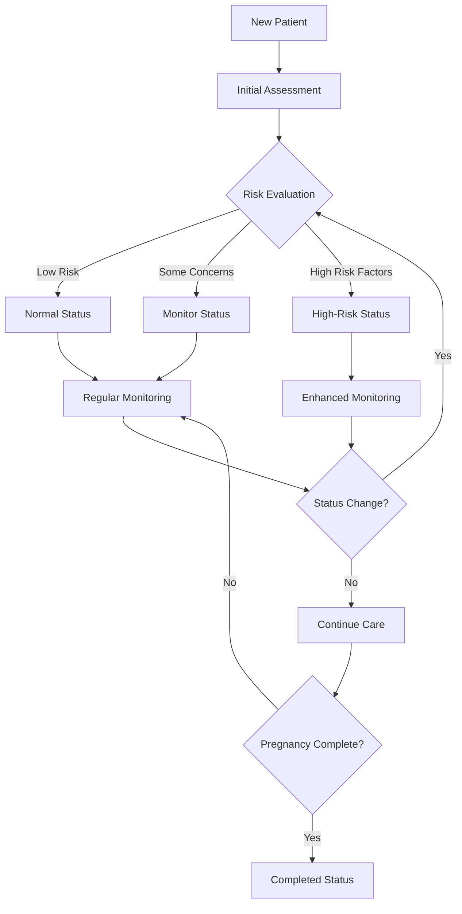

# Prenatal Record Status System Documentation

## Overview

The Prenatal Record Status System is a comprehensive classification framework used in the health-care application to categorize and monitor pregnancy risks, ensuring appropriate care levels for expectant mothers.

## Available Status Types

| Status | Code | Description | Visual Indicator |
|--------|------|-------------|------------------|
| **Normal** | `normal` | Standard pregnancy progression with no identified risks | Green badge |
| **Monitor** | `monitor` | Requires closer observation due to minor concerns | Yellow badge |
| **High-Risk** | `high-risk` | High-risk pregnancy requiring specialized care | Red badge |
| **Due** | `due` | Appointment or checkup is due | Blue badge |
| **Completed** | `completed` | Pregnancy completed (delivered) | Gray badge |

## High-Risk Status Classification

### Definition
A **high-risk pregnancy** is one where medical conditions or factors could lead to complications for the mother or baby, requiring specialized medical attention.

### Automatic Risk Factors

#### Age-Based Classification
```php
// Automatic high-risk determination based on maternal age
$isHighRisk = $patient->age < 18 || $patient->age > 35;
```

- **Under 18 years**: Teenage pregnancy complications
- **Over 35 years**: Advanced maternal age risks

### Medical Conditions Leading to High-Risk Status

#### Gestational Conditions
- **Gestational Diabetes** (diet controlled or insulin-dependent)
- **Pregnancy-Induced Hypertension** (PIH)
- **Placenta Previa** (placenta blocks birth canal)
- **Multiple Gestation** (twins, triplets)
- **Preeclampsia** (high blood pressure with protein in urine)

#### Pre-existing Medical Conditions
- **Chronic Hypertension** (controlled with medication)
- **Diabetes Mellitus** (Type 1 or Type 2)
- **Thyroid Disorders** (hypo/hyperthyroidism)
- **Cardiac Conditions**
- **Autoimmune Disorders**
- **Kidney Disease**

#### Obstetric History Risk Factors
- **Previous Cesarean Section** (VBAC candidate)
- **History of Preterm Labor** (<37 weeks)
- **Previous Pregnancy Loss** (miscarriage/stillbirth)
- **Previous Gestational Diabetes**
- **Previous Preeclampsia**
- **Grand Multiparity** (5+ previous births)

#### Additional Risk Factors
- **BMI >30 or <18.5**
- **Substance Use** (smoking, alcohol, drugs)
- **Domestic Violence**
- **Limited Prenatal Care**
- **Social Risk Factors** (poverty, lack of support)

## Status Determination Process

### Manual Assignment
Healthcare workers assess and assign status based on:

1. **Initial Assessment**
   - Medical history review
   - Physical examination
   - Laboratory results
   - Risk factor evaluation

2. **Ongoing Monitoring**
   - Regular prenatal visits
   - Ultrasound findings
   - Laboratory monitoring
   - Symptom development

3. **Clinical Judgment**
   - Professional assessment
   - Multi-disciplinary consultation
   - Evidence-based guidelines

### System Implementation
```php
// Location: app/Models/PrenatalRecord.php
public function getIsHighRiskAttribute()
{
    return $this->patient->age < 18 ||
           $this->patient->age > 35 ||
           $this->status === 'high-risk';
}
```

## Care Requirements by Status

### Normal Status
- ✅ **Schedule**: Standard prenatal visit schedule
- ✅ **Monitoring**: Routine assessments
- ✅ **Location**: Community health center acceptable
- ✅ **Provider**: Midwife or BHW primary care

### Monitor Status
- ⚠️ **Schedule**: Slightly increased visit frequency
- ⚠️ **Monitoring**: Enhanced observation for specific concerns
- ⚠️ **Location**: Community health center with backup plan
- ⚠️ **Provider**: Midwife with physician consultation available

### High-Risk Status
- 🚨 **Schedule**: Frequent prenatal visits (bi-weekly or weekly)
- 🚨 **Monitoring**: Specialized testing and monitoring
- 🚨 **Location**: Hospital-based care recommended
- 🚨 **Provider**: Multidisciplinary team (OB/GYN, specialists)
- 🚨 **Requirements**:
  - More frequent prenatal visits
  - Specialized monitoring equipment
  - Additional laboratory tests
  - Ultrasound surveillance
  - Specialist consultations
  - Detailed birth planning
  - Hospital delivery planning

### Due Status
- 📅 **Action Required**: Schedule overdue appointment
- 📅 **Follow-up**: Contact patient for rescheduling
- 📅 **Monitoring**: Assess reason for missed appointment

### Completed Status
- ✅ **Outcome**: Pregnancy concluded (delivery)
- ✅ **Records**: Archived for reference
- ✅ **Follow-up**: Postpartum care initiated

## Clinical Examples

### High-Risk Scenarios

#### Example 1: Advanced Maternal Age
```
Patient: 38-year-old woman
Risk Factors: Age > 35, first pregnancy
Status: high-risk
Care Plan:
- Genetic counseling
- Enhanced ultrasound monitoring
- Glucose tolerance testing
- Closer fetal surveillance
```

#### Example 2: Medical Complications
```
Patient: 28-year-old woman
Risk Factors: Gestational diabetes, previous C-section
Status: high-risk
Care Plan:
- Diabetic diet counseling
- Blood glucose monitoring
- VBAC counseling
- Enhanced fetal monitoring
```

#### Example 3: Multiple Risk Factors
```
Patient: 17-year-old woman
Risk Factors: Age < 18, poor nutrition, limited prenatal care
Status: high-risk
Care Plan:
- Nutritional counseling
- Social work consultation
- Frequent monitoring
- Support system development
```

## Database Schema

### Prenatal Records Table
```sql
enum('status', ['normal', 'monitor', 'high-risk', 'due', 'completed'])
    ->default('normal')
```

### Related Fields
- `medical_history` (text): Detailed medical background
- `notes` (text): Clinical observations and care plans
- `gravida` (integer): Total number of pregnancies
- `para` (integer): Number of births after 20 weeks
- `last_menstrual_period` (date): For gestational age calculation
- `expected_due_date` (date): Calculated delivery date

## Status Transition Workflow



## System Benefits

### For Healthcare Providers
- 📊 **Risk Stratification**: Clear patient categorization
- 📋 **Care Protocols**: Standardized care approaches
- 📈 **Resource Allocation**: Efficient use of limited resources
- 🎯 **Quality Assurance**: Evidence-based care delivery

### For Patients
- 🛡️ **Safety**: Appropriate level of care for risk level
- 📅 **Scheduling**: Right frequency of visits
- 💬 **Communication**: Clear understanding of pregnancy status
- 🤝 **Support**: Appropriate resource allocation

### for System Management
- 📊 **Reporting**: Track high-risk pregnancies
- 📈 **Analytics**: Monitor care outcomes
- 🎯 **Quality Metrics**: Measure care effectiveness
- 📋 **Compliance**: Meet healthcare standards

## Best Practices

### Status Assignment
1. **Comprehensive Assessment**: Review all risk factors
2. **Evidence-Based**: Use established guidelines
3. **Regular Review**: Reassess status at each visit
4. **Documentation**: Record rationale for status changes
5. **Communication**: Ensure patient understands status

### Monitoring Guidelines
1. **High-Risk**: Weekly or bi-weekly visits
2. **Monitor**: Every 2-3 weeks
3. **Normal**: Monthly until 36 weeks, then weekly
4. **Due**: Immediate follow-up required
5. **Completed**: Transition to postpartum care

## Conclusion

The Prenatal Record Status System provides a structured approach to pregnancy risk management, ensuring that all expectant mothers receive appropriate care based on their individual risk profiles. This system supports healthcare providers in delivering evidence-based, risk-appropriate prenatal care while optimizing resource utilization in community health settings.

## References

- World Health Organization (WHO) Guidelines on Pregnancy Care
- American College of Obstetricians and Gynecologists (ACOG) Practice Bulletins
- Philippine Obstetrical and Gynecological Society (POGS) Guidelines
- Department of Health (DOH) Maternal Care Standards

---

*Last Updated: January 2025*
*Document Version: 1.0*
*System Version: Health Care Management System v2025*